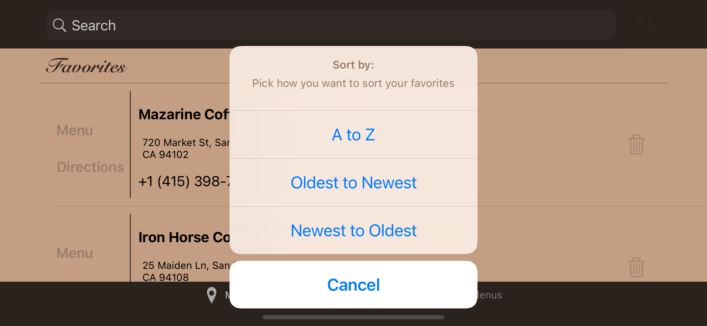

# Coffee Shack, iOS Developer: Elias H.

**Run instructions:**
Xcode 13.2.1, iOS Deployment Target: 15.2, 

**Overview:**
This app searches for nearby coffee places.

**Walkthrough:**
When the user enters the app, nearby coffee icons are generated. In the map view, the user can select a coffee icon, which pops up the location's details. When the toggle button in the top right is selected user can view the map icons in table format. The user can search nearby locations based on position in map or return to user's current location. User can favorite a location by selecting the heart icon. When viewing the detail they have the option of tapping for the url/menu or directions.
When a location is favorited the user can see the added location in the second tab- the 'Menu's' tab. The user can use the search bar to search favorited locations. They can sort the favorites for their convenience or they can delete favorites.

**User permissions:**
No login required

**Tools used:**
Core Data, UIKit, iPhone 11 Pro/ iPhone 12 simulator

**Select below for larger clearer images**

